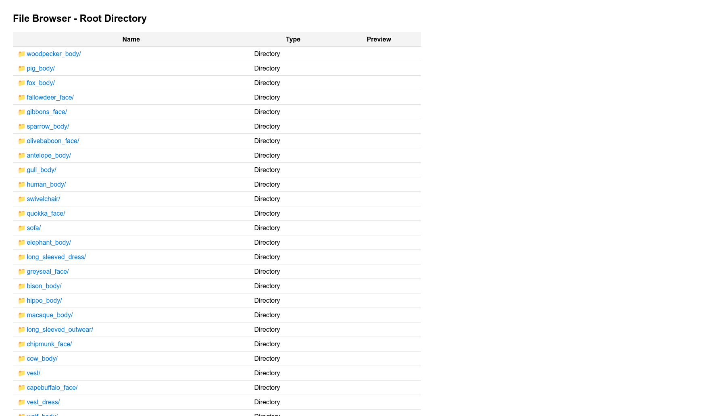
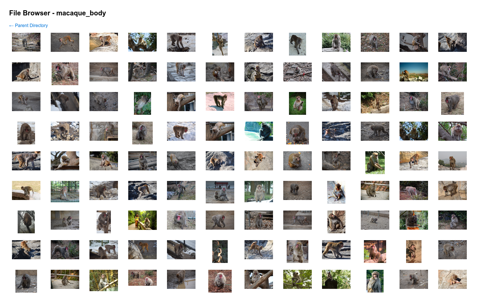
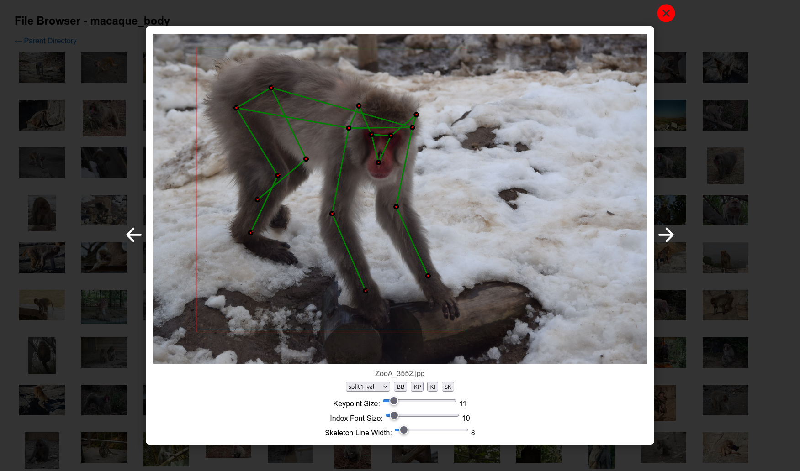

# MP100 dataset builder

This script provides instructions to download and prepare various datasets used in the MP100 dataset. It includes steps for downloading datasets like COCO 2017, 300W, AFLW, OneHand10K, DeepFashion2, AP-10K, MacaquePose, Vinegar Fly and Desert Locust datasets, CUB-200, CarFusion, AnimalWeb, Keypoint-5, and MP100 annotations.

The original instructions are available in the [MP100 repository](https://github.com/luminxu/Pose-for-Everything/tree/main/mp100).

## Preparation

Create a `.env` file in the repo directory, using the provided `.example.env` as a template:

```bash
cp .example.env .env
```

Install the required packages:

```bash
# Python 3.10
conda create -n mp100 python=3.10
conda activate mp100
pip install -r requirements.txt
```

## Download COCO 2017 dataset

Link: https://cocodataset.org/#download

```bash
wget http://images.cocodataset.org/zips/train2017.zip
unzip train2017.zip
```

## Download 300W dataset

Link: https://ibug.doc.ic.ac.uk/resources/300-W/

```bash
python download_300w.py
```

## Download AFLW dataset

Link: https://www.tugraz.at/institute/icg/research/team-bischof/learning-recognition-surveillance/downloads/aflw

Fill out the form to get the download link, then download the dataset:

```bash
mkdir AFLW
cd AFLW
# Download and unzip the dataset zip file and place it here
cd ..
```

## Download OneHand10K dataset

Link: https://www.yangangwang.com/papers/WANG-MCC-2018-10.html

Fill out the form to get the download link, then download the dataset:

```
Soon^tm (until I get the link)
```

## Download DeepFashion2 dataset

Link: https://github.com/switchablenorms/DeepFashion2

Fill the form to get the unzip password

```bash
mkdir DeepFashion2
cd DeepFashion2
gdown --fuzzy 12DmrxXNtl0U9hnN1bzue4XX7nw1fSMZ5 # Download json_for_validation.zip
gdown --fuzzy 1hsa-UE-LX8sks8eAcGLL-9QDNyNt6VgP # Download test.zip
gdown --fuzzy 1lQZOIkO-9L0QJuk_w1K8-tRuyno-KvLK # Download train.zip
gdown --fuzzy 1O45YqhREBOoLudjA06HcTehcEebR0o9y # Download validation.zip
unzip -P [password] json_for_validation.zip
unzip -P [password] test.zip
unzip -P [password] train.zip
unzip -P [password] validation.zip
cd ..
```

## Download AP-10K dataset

Link: https://github.com/AlexTheBad/AP-10K?tab=readme-ov-file#download

```bash
gdown --fuzzy 1-FNNGcdtAQRehYYkGY1y4wzFNg4iWNad
unzip ap-10k.zip
```

## Download MacaquePose dataset

Link: https://www.pri.kyoto-u.ac.jp/datasets/macaquepose/index.html

```bash
wget https://www.pri.kyoto-u.ac.jp/datasets/macaquepose/download.php -O macaquepose_v1.zip
unzip macaquepose_v1.zip
```

## Download Vinegar Fly and Desert Locust datasets

Link: https://github.com/jgraving/DeepPoseKit-Data

```bash
git clone https://www.github.com/jgraving/deepposekit-data.git
python deepposekit_loader.py
``` 

## Download CUB-200 dataset

Link: https://www.vision.caltech.edu/datasets/cub_200_2011/

```bash
wget https://data.caltech.edu/records/65de6-vp158/files/CUB_200_2011.tgz
tar -xvzf CUB_200_2011.tgz
```

## Download CarFusion dataset

Link: http://www.cs.cmu.edu/~ILIM/projects/IM/CarFusion/cvpr2018/index.html

Fill out the form to get the google drive link, then clone this repository,

```bash
git clone https://github.com/dineshreddy91/carfusion_to_coco.git
cd carfusion_to_coco
# Download the file download_carfusion.py to this dir (This file need to be downloaded by requesting, please fill to get access to the data)
sh carfusion_coco_setup.sh
cd ..
```

Rename the images names using [PoseAnything](https://github.com/orhir/PoseAnything/blob/main/tools/fix_carfuxion.py) tool script:

```bash
python fix_carfusion.py carfusion_to_coco/datasets/carfusion mp100/annotations
```

## Download AnimalWeb dataset

Link: https://fdmaproject.wordpress.com/author/fdmaproject/

```bash
gdown --fuzzy 13PbHxUofhdJLZzql3TyqL22bQJ3HwDK4
7z x animal_dataset_v1_c.rar # Extract the dataset
```

## Download Keypoint-5 dataset

Link: https://github.com/jiajunwu/3dinn

```bash
wget http://3dinterpreter.csail.mit.edu/data/keypoint-5.zip
unzip keypoint-5.zip -d keypoint5
```

## Download MP100 annotations

Link: https://github.com/orhir/PoseAnything

Use the updated annotations of PoseAnything:

```bash
mkdir mp100
cd mp100
gdown --folder https://drive.google.com/drive/folders/1uRyGB-P5Tc_6TmAZ6RnOi0SWjGq9b28T
mv Data annotations
cd ..
```

## Build the dataset

After downloading all datasets, the structure should look like this:

```bash
./
├── 300W # 300W dataset
├── AFLW # AFLW dataset
├── ap-10k # AP-10K dataset
├── train2017 # COCO 2017 dataset
├── animal_dataset_v1_clean_check # AnimalWeb dataset
├── CUB_200_2011 # CUB-200 dataset
├── DeepFashion2 # DeepFashion2 dataset
├── macaquepose_v1 # MacaquePose dataset
├── OneHand10K # OneHand10K dataset (not available yet)
├── deepposekit-data # Vinegar Fly and Desert Locust datasets
    └── datasets
        ├── fly # Vinegar Fly dataset
        └── locust # Desert Locust dataset
├── carfusion_dataset # CarFusion dataset
├── keypoint5 # Keypoint-5 dataset
└── mp100 # MP100 dataset
    └── annotations # Annotations for MP100 dataset
        ├── mp100_split1_test.json
        ├── mp100_split1_train.json
        ├── mp100_split1_val.json
        ├── mp100_split2_test.json
        ├── mp100_split2_train.json
        ├── mp100_split2_val.json
        ├── mp100_split3_test.json
        ├── mp100_split3_train.json
        ├── mp100_split3_val.json
        ├── mp100_split4_test.json
        ├── mp100_split4_train.json
        ├── mp100_split4_val.json
        ├── mp100_split5_test.json
        ├── mp100_split5_train.json
        └── mp100_split5_val.json
```

Run the validate script to check the dataset structure:

```bash
python create_dataset.py --mode valid_org
```

If the validation passes, you can create the dataset:

```bash
python create_dataset.py --mode create
```

The script will find and copy the images from the downloaded datasets based on the `dir_mapping.json` file, which maps dataset names to their respective directories.

This will generate the dataset in the `mp100` directory, which can then be used for training and evaluation.

Validate the dataset structure again to ensure everything is correct:

```bash
python create_dataset.py --mode valid
```

After creating the dataset, you should see the following structure in the `mp100` directory:

```bash
mp100/
├── annotations
│   ├── mp100_split1_test.json
│   ├── mp100_split1_train.json
│   ├── mp100_split1_val.json
│   ├── ... (other splits)
├── images
│   ├── woodpecker_body
│       ├── American_Three_Toed_Woodpecker_0018_179831.jpg
│       ├── Red_Cockaded_Woodpecker_0003_794695.jpg
│       ├── ... (other images)
│   ├── pig_body
│   ├── fox_body
│   ├── fallowdeer_face
│   ├── gibbons_face
│   ├── sparrow_body
│   ├── olivebaboon_face
│   ├── antelope_body
│   ├── gull_body
│   ├── human_body
│   ├── ... (other categories)
```

## Clean up

After creating the dataset, you can clean up the temporary directories and files:

```bash
sh clean.sh
```

## Visualization

To visualize the dataset, you can use the provided visualization tools. The file browser allows you to navigate through the dataset images and view annotations.

```bash
python visualize/vis.py --dataset-dir mp100 --host 0.0.0.0 --port 8000
```

This will start a web server that you can access in your browser at `http://localhost:8000`. You can view images, annotations, and other dataset details.

### Demo images

<div align="center">

</div>
<div align="center">

</div>
<div align="center">

</div>
